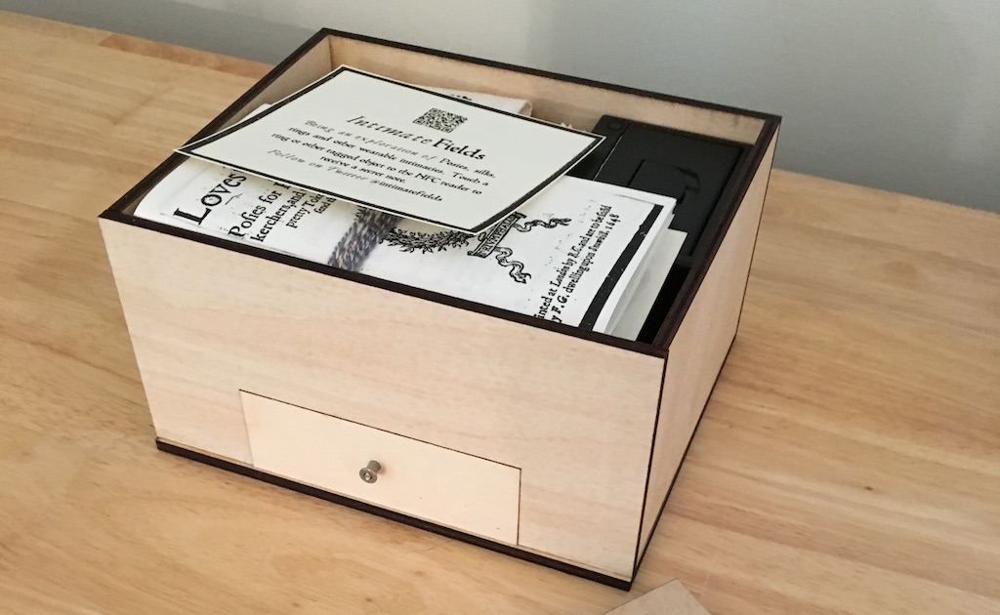

### About the Project

<figure>

<figcaption>“Every secret has its little casket.”  -- Gaston Bachelard.</figcaption>
</figure>

*Intimate Fields* is an installation work that brings together “near field” technologies from markedly different eras to argue that secrecy, absence, and distance are constituting features of felt human intimacy. Looking back to the sixteenth and seventeenth centuries, our project expands to digital technologies the concept of “the posy” and the practice of its creation and dissemination. Posies are short poems designed to be inscribed on gifted objects, most frequently rings. These bespoke accessories are meant to be worn on the body and to signify or transact amorous relations, act as memento mori, or even enable private and subversive modes of religious devotion. Posies and their objects were widely held to act as reminders of intimacy or as portals to memory. At the same time, the inscriptions themselves, particularly on courtship rings, are often generic and were collected and published in printed books for use and adaptation. By inter-animating today’s methods of near field communication and early modern wearables, this project explores how text and code technologies and the languages they carry can create, interrupt, or re-shape interpersonal connection.

*Intimate Fields* allows users to explore these potentials through a compact installation work that can be placed on a small table for display. The installation consists of a wooden laser cut box with multiple compartments. The box is bundled with an NFC (near field communication) reader connected to an Arduino Flora microcontroller and miniature thermal printer. Items in the box include printed scrolls and notes containing NFC stickers, textile items containing knotted codes, and a series of six ceramic/steel rings with embedded NFC chips. On touching the scrolls, notes and rings to the NFC reader, scripts are triggered to generate brief affectively charged poems remixed from a range of historical and contemporary texts. An accompanying bot posts remixed versions of posies to Twitter at regular intervals.

#### A Kit for Material Culture

*Intimate Fields* was inspired by the work of Jentery Sayers and the MLab at the University of Victoria. There, Sayers curates a series of maker-inspired digital humanities projects called “Kits for Culture,” in which our project will eventually reside as Volume 3 in the series. The mandate for Sayers’ original *Early Wearables Kit* was to create what he called a “fluxkit for scholarly communication,” drawing on the Fluxus model in which boxes are assembled of inexpensive materials to create a shareable art object. Sayers imagined using this model to create what he calls “small boxes of inexpensive materials assembled for media history” – kits that can be shared and recreated as scholarly objects that both reveal aspects of material history as well as “prototype speculations about the past” based on absences in what we know – in other words, to build objects that “recover, repair, and re-contextualize the stuff of history.” The Kits are designed to be reproducible and executable – shareable like code, while simultaneously being executed on a local material platform (in code’s case, a desktop computer; in the Kit’s case, a 3D printer, laser cutter, etc). Indeed, *Intimate Fields* makes use of some of the digital lasercutter schematics from the original Early Wearables kit – it is a fork, in Github’s vernacular, in which project files are copied, modified, and either given a new space (in this case, the repository for Intimate Fields) or pushed back to the original.

As a work in the Kits for Culture series, *Intimate Fields* seeks to share in some of these ideas: reproducibility, prototyping, speculation, play. As a work of media history, its aim is to reveal how media objects conveyed secrets in the early modern period, and extend “media objects” as a term to encompass the smell of rosemary and rosewater, the tactility and luster of linen and handspun silks, the intimate feel of a ring hugging the finger or laying suspended from a thread next to the skin. At the same time, it is clearly a creature of our own moment in history: the inclusion of Near Field Communication chips and an electronic reader shift the reader’s awareness into the now, even while drawing attention to the way in which media objects have always held secrets, if only we knew how to read them. The NFC chip and its forerunner the RFID system bring to the forefront the idea of intimacy. There is a secret message here, in this seemingly unreadable and yet strangely beautiful object with its spiraling copper coils and magnifying-glass chip. But we can only “read” it if we place it in intimate proximity to a reader, tuned to the right frequency, coded to find the right blocks of data on the chip. The reader induces a current in the coil, much as opening a secret message induces an affective current in the heart – anticipation, longing, release. Induction, magnetization. 13.56 Mhz of electric love. Typical visual representations of a NFC transaction – and it usually is a transaction, between a mobile device and a payment terminal – represent the moment of communication as a kind of “ray-gun”, beaming information from active device to passive reader. But that’s not how NFC works at all. The reader itself induces current, creating a communicative field that, if it could be seen, would be more accurately characterized as a kind of “fountain” of energy, moving through the chip, inducing new current, and spiraling back to the reader like the roil of the earth’s molten iron core. Magnetism has its own aesthetic.

*Intimate Fields* also bears witness to Sayers’ observation that reproduction is inevitably an act of situated practice, in which the embodied act of prototyping necessarily changes the act of interpretation. The specific instance of Intimate Fields built for exhibit at the Conference festival here betrays our own particular passions, sourcing materials that speak to us in specific ways (for Maggie, the magic of finding specific letter-folding techniques and reproducing them in specific papers; for Helen, the snagging of raw silk fiber on skin, the twirl of the spindle’s whorl). Here, we offer two boxes: one that is “executed,” complete, and imbued with our own bodily labor and affects, and a second one that is a schematic, a range of possibilities, a kind of historical narrative recipe for reconstructing secrets. In this way, Intimate Fields is a “kit for e-Literature”: a kit for reconstructing potential texts that include both material and electronic, hard and soft elements.

#### Harboring Secrets

In *The Poetics of Space*, Gaston Bachelard observes that

>“Wardrobes with their shelves, desks with their drawers, and chests with their false bottoms are veritable organs of the secret psychological life. Indeed, without these ‘objects’ and a few others in equally high favor, our intimate life would lack a model of intimacy. They are hybrid objects, subject objects. Like us, through us and for us, they have a quality of intimacy.”

Turning specifically to “small boxes, such as chests and caskets,” he notes that “These complex pieces that a craftsman creates are very evident witnesses of the need for secrecy, of an intuitive sense of hiding places.” Intimate Fields uses the coincidences and asynchronies of early modern and contemporary communication technologies to open considerations of secrecy, intimacy, and the felt dynamics of space. Playing on the relationship between the early practice of inscribing short poems (posies) on gifted (and often wearable) objects and today’s near-field technologies, the project aims to initiate affective experiences in the ways that text technologies shape intimate environments. Its drawers and compartments concealing a small thermal printer, electronic components, intricately folded letters bound with knotted silks, a set of ceramic and steel “smart rings” embedded with NFC chips, embroidered handkerchiefs, and a slim volume of anonymous seventeenth-century love poems entitled *Loves Garland*, the box confronts viewer/makers with how intimacy inheres (or doesn’t) in communicative objects. The kit incites different performances of Bachelard’s claim for the connection between feelings of intimacy and their physical manifestions. Our installation is designed to be multi-sensory and to experiment with how a variety of small objects, some wearable, communicate across a spectrum of intimacy and distance, past and present, permanent and ephemeral, hidden and visible, linear and recursive.

#### Openings and Closings: Intimate Fields as Material e-Lit

Approached as a work of electronic literature, *Intimate Fields* is deeply embedded in both the physicality of its multiple media and the ephemerality of its flickering codes. As such, it is satisfyingly subject to many of the joys we take in engaging with a work of electronic literature. Just as when we click on a launch screen, unboxing *Intimate Fields* transforms it from a single object (a box) into something else: a sudden cornucopia of sensory, tactile and visual treats. The act calls to mind Bachelard’s caskets:

>“Chests, especially small caskets, over which we have more complete mastery, are objects that may be opened. When a casket is closed, it is returned to the general community of objects; it takes its place in exterior space. But it opens!”

And upon that initial opening, we have whole adventures of unpacking, unfolding, smelling, plugging in, scanning, un-knotting, to engage in, like a whole garden of forking paths, links to click. Diving deeper, just as when we venture as e-literature practitioners into “view source” territory in an effort to find the codes that create an effect or affect, so too can we delve into the source code of Intimate Fields’ electronics, or scan the pamphlet that contains these generic-but-strangely-specific messages, like short text strings in the arrays that make up Taroko Gorge or other remix works.

And again, in the moment of closure: unplug the Flora, watch the LED wink out. Now we are left with intriguing but indecipherable chunks of plastic and metal: no more intimate fields. A second closure: the printed pamphlet is re-wrapped in silks, stored. Fold up the letters, close the drawer, replace the lid. All we are left with now is an opaque object, is the strange cipher of a single NFC chip on the lid. This is a familiar book-like moment: that moment when we close the cover, the text disappears and we’re left with the thing, the artefact. Susan Stewart, in her meditation on miniatures, notes this strange property of the book-as-thing, in which the book occupies a fascinating position somewhere between materiality and abstraction – object and text:

>“The book sits before me, closed and unread; it is an object, a set of surfaces. But opened, it seems revealed; its physical aspects give way to abstraction and a nexus of new temporalities. … The metaphors of the book are metaphors of containment, of exteriority and interiority, of surface and depth, of covering and exposure, of taking apart and putting together. To be ‘between covers’ – the titillation of intellectual or sexual reproduction.”

In computing, Scott Dexter notes the ambivalence we have toward that act of uncovering and covering over, noting that it is both built into code (by virtue of and prone to slippage between different “layers” and practices) and itself a kind of misdirection that depends on our desire to retain some mystery, something hidden we cannot access:

>“that which software purports to hide – that which it therefore might be compelled to make visible – is rarely what is actually hidden, … This slip, these layers of desire for mystery, for open secrets, for the yielding of authority, are the primary generators of the esthetic of the hidden which suffuses modern computing.”

*Intimate Fields* in some ways contributes to this “esthetic of the hidden”, with its emphasis on codes and secret messages, its sharing of “what lies beneath” in a repository as a way of reproducing a reconfigured kit. But it also celebrates secrecy as a material, social and discursive practice, with the knowledge that even if we uncover the code, we are still embedded in our specific circumstances. Our secrets are different to those of early modern lovers. The materials are different; our bodies are different; our modes of communicating love (or even our understanding of what love is) are different. As Lucy Suchman puts it,

>“mutual constitutions of humans and artifacts do not occur in some single time and place, nor do they create fixed human/artifact relations. Rather, artifacts are produced through highly specialized ‘labours of division’… that involve continuous work across particular occasions and multiple sites of use.”

Indeed, the pleasure of working with a box/book like Intimate Fields is two-fold: as a finished object, it caters to our love of the artefact, the play of unpacking and revealing, the insight into early modern literature. It is, fundamentally, an act of deep and engaged reading. But downloading, reconfiguring and building one’s own *Intimate Fields* box presses a different set of pleasurable buttons as well, familiar to us as writers working with electronic literature: the sense that there is a “taking apart and putting together” not just of ideas and words but materials, assets, objects, actions. Intimate Fields provides a playground within which to explore ideas of history, mediation, materiality, technology, encoding and decoding, and remixing – surely, the fertile and experimental playground we inhabit as readers and practitioners of electronic literature.

***

#### Works Cited

Bachelard, Gaston (1958). *The Poetics of Space*. 1994. Boston, MA: Beacon Press.

Dexter, Scott (2012). “The Esthetics of Hidden Things.” Berry, D. ed. *Understanding Digital Humanities*, 127-144. London, GB: Palgrave Macmillan, 2012.

Sayers, Jentery (2015). “Kits for Cultural History, or Fluxkits for Scholarly Communication.” *Hyperrhiz: New Media Cultures* 13. doi: https://doi.org/10.20415/hyp/013.w02

Stewart, Susan (1993). *On Longing: Narrative of the Miniature, the Gigantic, the Souvenir, the Collection*. Durham: Duke UP.

Suchman, Lucy (1999). “Human/Machine Reconsidered” (draft). Published by the Department of Sociology, Lancaster University. http://www.lancaster.ac.uk/sociology/soc040ls.html.