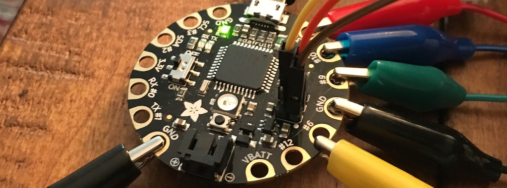
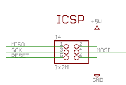
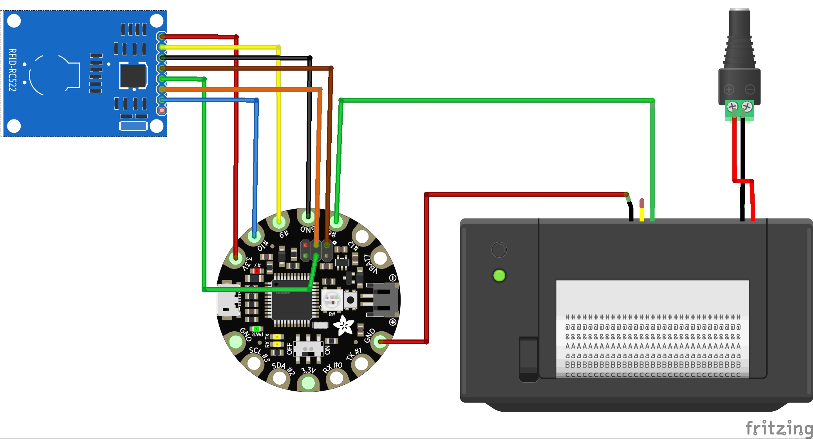

### Arduino

<figure>

<figcaption>Flora board, the core of <em>Intimate Fields</em> v.1.</figcaption>
</figure>

#### When to use

This "plug and play" Arduino version of *Intimate Fields* is designed for ease of assembly, and requires no external equipment once it's set up (apart from two power outlets). We recommend this version for classroom use or travelling exhibit.

#### Ingredients

You'll want three primary electronic components:

1. An Arduino board (we used a Flora for *Intimate Fields*, but there are many alternatives; use what you have access to).
2. An NFC reader. For Intimate Fields we used the widely available MRC522 board. You can find these on Amazon (look for manufacturer Sunfounder) or Aliexpress.
3. A thermal printer. We used the "tiny" version of the A2 printer available from Adafruit and Sparkfun.

In addition, you'll need

4. NFC tags. We used Mifare Classic tags and the tiny Mifare Ultralight tags available from Adafruit, Sparkfun, Amazon or Aliexpress; for a less expensive version, NFC stickers are a good choice.
5. Arduino IDE, for programming your board.
6. Connectors:
    - 4x alligator/female jumper cables in red, yellow, black, and blue.
    - 3x female-to-female jumper cables in orange, brown, and green.
    - 2x alligator-to-male jumper cables in black and green.
    - A barrel jack connector for the thermal printer's power supply.
    - A 5V 2A barrel jack wall plug for the printer.
    - a USB/micro USB power cable for the Flora.

#### Schematics

Before you start: you'll need to solder the SPI pins to the Flora. Take six header pins (2 rows of 3) and solder them into the set of six little holes punched into the board.

The RC522 Reader should be connected as follows to the Flora (with Arduino Uno equivalents also shown in case you have one of those instead):

<table class="table">
<thead>
<tr>
<td>Signal</td>
<td>RC522</td>
<td>Flora/Uno</td>
<td>Jumper wires</td>
</tr>
</thead>
<tbody>
<tr><td>VCC	</td><td>VCC</td><td>3.3V</td><td>RED ALLIGATOR</td></tr>
<tr><td>RST/Reset</td><td>RST</td><td>9</td><td>YELLOW ALLIGATOR</td></tr>
<tr><td>GND</td><td>GND</td><td>GND</td><td>BLACK ALLIGATOR</td></tr>
<tr><td>SPI SS</td><td>SDA(SS)</td><td>10</td><td>BLUE ALLIGATOR</td></tr>
<tr><td>SPI MOSI</td><td>MOSI</td><td>11 / ICSP-4</td><td>GREEN JUMPER</td></tr>
<tr><td>SPI MISO</td><td>MISO</td><td>12 / ICSP-1</td><td>BROWN JUMPER</td></tr>
<tr><td>SPI SCK</td><td>SCK</td><td>13 / ICSP-3</td><td>ORANGE JUMPER</td></tr>
</tbody>
</table>
 
>On the Flora, the SPI pins are counted in order with pin #1 marked by a little white dot:
 

 
The printer has two sets of wires: one for power (2 wires, red and black) and one for signal (5 wires). The power has to be run separately because thermal printers use a lot of current. For the power wires (red and black), cut the JST connector off one end and strip and connect the wires to a barrel jack connector, with red going to + and black going to -. Then power it using a 5V 2A barrel jack plug.

To get signal from the Flora, connect a cable from Flora's pad 6 to the green TX line (the center), and a cable to GND. Normally you can tell GND cables because they're black; however if you check the labels on the underside of the printer you may see that the wire colors are reversed on this model. So connect the Flora GND to the red wire on the printer. You can cut the other three (black, blue, yellow) wires.

The "tiny" version of the printer (used in Intimate fields) uses the following connectors:

<table class="table">
<thead><tr><td>Signal</td><td>Flora</td><td>Connector</td></tr></thead>
<tbody>
<tr><td>5V</td><td></td><td>Barrel Jack +</td></tr>
<tr><td>GND (power)</td><td></td><td>Barrel Jack  -</td></tr>
<tr><td>GND (signal)</td><td>GND</td><td>BLACK/RED ALLIGATOR</td></tr>
<tr><td>TX</td><td>6</td><td>GREEN ALLIGATOR</td></tr>
</tbody>
</table>
 
Here's a complete diagram:

 
#### Code

This page assumes you have a basic understanding of the Arduino IDE and its method for loading sketches onto your board. Code-wise, you'll need:

1. The sketch `get_ID_printer.ino` from the Intimate Fields repository.
2. The [mfrc522 RFID library](https://github.com/miguelbalboa/rfid) and the [Adafruit thermal printer library](https://github.com/adafruit/Adafruit-Thermal-Printer-Library). You can add both these via `Sketch > Include Library > Manage Libraries...` in the Arduino IDE, using the search terms "MFRC522" and "Thermal."

For this "standalone" version, the secret posies are hard-coded; i.e. each tag represents a single posy. In an ideal world, you'd be able to program the posy text directly onto the tags using an NFC writer (most commonly, an Android writer app). But since Android won't write to Mifare Classic tags, and the mfrc522 library has trouble reading the text on Ultralight tags, we've chosen a much simpler approach: read the unique ID number for each tag, and match it to a specific posy text in the code. The downside of this approach is that changing the text requires logging each tag ID number in your specific project and replacing the posy text in the code, rather than writing it directly on the tag where it can be read by other devices. We've included two copies of the sketch in our repository: one with our specific tags, and a second "blank" one for you to use in your own project.

To alter the code to work with your NFC tags, first you'll need to log them all. Take the blank `get_ID_printer.ino` sketch and upload it to your Flora. Now try touching an NFC tag to the printer: you should get a readout of the ID number. Touch all the tags in turn and take a note of all the ID numbers. Then, go back to your Arduino sketch and put in one `if` statements and as many `else if` statements as you need for all your tags, matching each ID number with a posy of your choice (put in `\n` for a new line), e.g.

      else if(uid == 4294957818){
      printer.println("A posie in a Ring:\nRemember this, and give a kisse.");
      }

Once they're all coded up and the sketch is reuploaded to the Flora, you should have a fully functional reader/printer for secret NFC posies.
