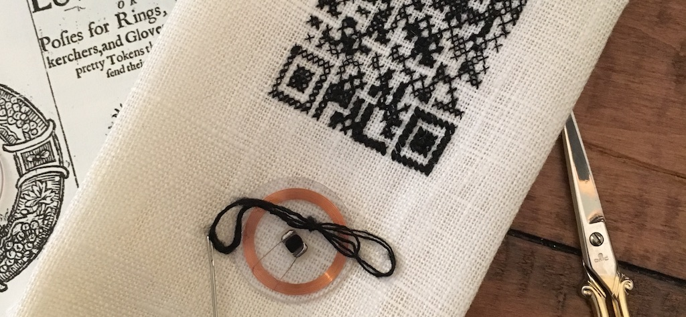

### Embroidery and Blackwork

<figure>

<figcaption>Cross-stitched Twitter QR code in silk on linen.</figcaption>
</figure>

#### Embroidery

Embroidery in the early modern period was the purview of women, and often served as a collective practice which could be undertaken in schoolhouse or in a domestic space. Book bindings of devotional texts were frequently embroidered, speaking to the relationship between the tactile and the immaterial, spiritual, and affective experiences such touching  might enable. Today’s widely available patterns for machine embroidery might also invite contemplation about replicability and individual variation in the needle arts, which resonates with the bespoke and generic aspects of the posies themselves. While women did not publish manuals for needlework in the period of Loves Garland they did routinely adapt designs.

>The wit of man by divers things is tried  
>some for the soul do bend their study still:  
>some on the seas do search the world so wide,  
>in alchemy some other tries their skill:  
>some other love the liberal arts to learn,  
>the ground of knowledge thereby to discern.

>but far unfit for tender women kind,  
>such toilsome studies altogether be:  
>although their wits most sharp and swift we find,  
>yet with their strength these things do not agree:  
>their milky white hands the needle finer fits,  
>with silk and gold to prove their pregnant wits,

>In needle works there doth great knowledge rest.  
>A fine conceit thereby full soon is shown:  
>a drowsy brain this skill cannot digest,  
>pains spent of such, in vain away is thrown:  
>they must be careful, diligent and wise,  
>in needle works that bear away the prize.

>This work beseemeth Queens of great renown,  
>and noble ladies of a high degree:  
>yet not exempt for maids of any town,  
>for all may learn that thereto willing be:  
>come then sweet girls and hereby learn the way,  
>with good report to live another day.

>For many maidens but of base degree,  
>by their fine knowledge in this curious thing:  
>with noble ladies oft companions be,  
>sometimes they teach the daughter of a king:  
>thus by their knowledge, fame, and good report  
>they are esteemed among the noblest sort.

>Then pretty maidens view this pretty book,  
>mark well the works that you therein do find  
>sitting at work cast not aside your look,  
>they profit small that have a gazing mind:  
>keep clean your samplers, sleep not as you sit,  
>for sluggishness doth spoil the rarest wit.

#### Blackwork

A popular embroidery technique in the Elizabethan era was “blackwork,” a form of embroidery utilizing silk thread (typically black, although sometimes with red or gold embellishment) and stitched on linen fabric. Blackwork can be counted, or stitched in “Holbein Stitch,” similar to a running stitch, creating fine lines and a “filigree” or reverse-lace effect used on coifs and shirt detailing. Blackwork is sometimes called “Spanish Blackwork” in the belief that the style originated in popularity with Catherine of Aragon, although the true origin is unclear.

***

#### Works Cited

Bertolet, Anna Riehl. “‘Like Two Artificial Gods’: Needlework and Female Bonding in A Midsummer Night’s Dream.” In *Medieval Clothing and Textiles*, edited by Robin Netherton and Gale R. Owen-Crocker, 11:159–78. Suffolk: Boydell & Brewer Ltd, 2015.

http://google.com

https://google.com

Mirabella, Bella. “The Contradictory Life of the Handkerchief – Early Modern Women: Lives, Texts, Objects,” September 18, 2016. https://martinevanelk.wordpress.com/2016/09/18/the-contradictory-life-of-the-handkerchief/

Munroe, Jennifer. “‘In This Strang Labourinth, How Shall I Turne?’: Needlework, Gardens, and Writing in Mary Wroth’s ‘Pamphilia to Amphilanthus.’” *Tulsa Studies in Women’s Literature* 24, no. 1 (2005): 35–55.

Ziegler, Giorgianna. “‘’More than Feminine Boldness’’: The Gift Books of Esther Inglis.’” In *Women, Writing, and the Reproduction of Culture in Tudor and Stuart Britain*, edited by Mary E. Burke et al., 19–37. New York: Syracuse University Press, 2000.

Needlework poem source: http://eebo.chadwyck.com.prox.lib.ncsu.edu/search/full_rec?SOURCE=pgimages.cfg&ACTION=ByID&ID=V21634&PAGENO=3
