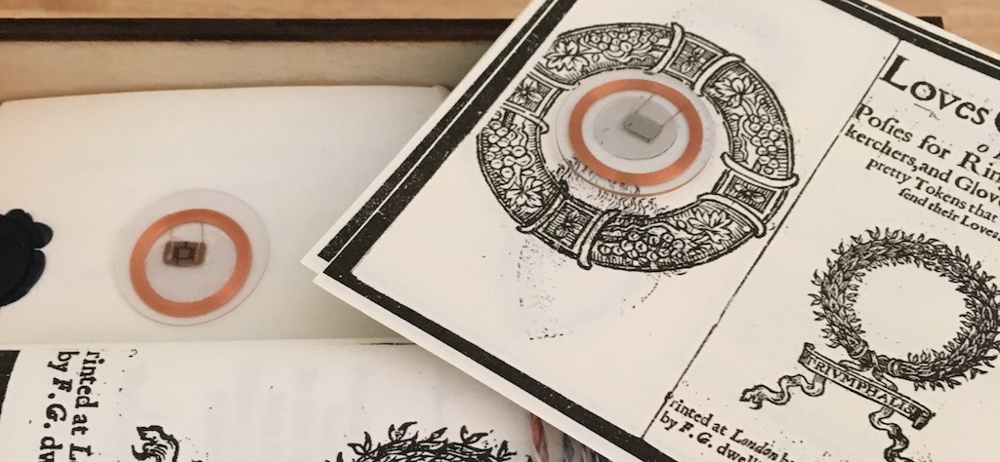

### Posies and *Loves Garland*

<figure>

<figcaption>Loves Garland, tagged with NFC chips.</figcaption>
</figure>

#### On Posies

Most simply, a posy is a short poem meant to be inscribed on an object. In the early modern period (c. 1450-1660 CE) posies often appeared on rings or were sent with handkerchiefs or gloves. Posies convey their messages of love and faith through what Juliet Fleming has called “physical extension,” (43) which is to say posies “work to underline the structural match between themselves and their inscription” (143). Fleming offers the posy “Bent to content” to illustrate how the ring’s form reinforces it’s posy’s sentiment. Posies were often recorded in manuscript miscellanies, adapted and recontextualized, and were sometimes repurposed from one lover to the next. Thomas Wythorne likes one of his posies so well that he claims if he “should make another wedding ring it should have the same sentence” (159). They are both intimate and generic. The posy travels on closely held objects. On the embroidered handkerchief, tasked with absorbing the body’s affect (tears) and action (sweat, dirt). On the inner band of a ring, tight against the finger. A note in the fold of a glove. But posies, like their objects, are also common lovers’ trifles, generic enough to become sentimental tropes, usable by anyone. Posies offer often unambiguous sentiments:

>To me till death  
>As near as breath.

>In thee a flame,  
>In me the same.

>I do rejoice in thee my choice.

Posies are individuated and transferrable. The posy’s meaning fixes upon a “thingly” substrate, like a ring, while being transmitted through others, including print collections and digital archives. Attaching to things but staying on the move, posies both invoke and escape the bodies, objects, writing practices, time, and textualities that claim to shape their function. Posies signify most during specific moments of inscription and exchange, while also making themselves available for transmission and reuse elsewhere. When posies are printed in collections or inscribed in miscellanies, they implicitly plot their escape from these very archiving forms.  Posies want to travel across bodies in different embodied states. Printed posies reveal the material limits of the book form which contains words, and words as things, but not things themselves. As codes for the propagation of objects, posies speak to today’s encounter with coded text, initiating a hidden refrain that reverberates to today’s digital texts and their “esthetics of secrecy.”

#### *Loves Garland*

Literary representations of posies, and particularly posy rings, often paradoxically intermingle the intimate and unknowable. Chaucer’s narrator in Troilus and Cressida watches the lovers exchange rings but can’t read their inscription (III.1369); the rings act to enclose the lovers, the small nature of the inscription establishing a near field into which only the lovers are allowed. In other cases, the posy is inscrutable even to the lover, acting as a trope for female duplicity. John Lyly writes in Euphues (1578) “’the posies on your rings are always next the finger, not to be seen of him that holdeth you by the hand’” (163).  The ring is a surrogate for the absent lover’s secret touch, maintaining intimacy even as her hand as held by another. Such literary representations also speak to the ring’s tradition as a surrogate for the woman’s penetrable body and breachable chastity. The intimate space of the ring analogizes the intimate space of its wearer’s body (Newman 31).

The compiler of *Loves Garland*, the reproduced collection of posies we include in *Intimate Fields*, brings subtle attention to the bodies involved in such exchanges by reminding readers of one posy, sent by a certain Nanne to the solicitous Will, whom she is rejecting. This posy, the text claims, would have originally been written in Nanne’s “fair Romish” script. The editorial voice is intent on preserving the posy’s human agent; it is shaped by a particular hand. The emphasis on Nanne’s italic handwriting (a hand typical for women and for more personal exchanges [Starza Smith]) as “fair” might suggest it as pretty, or as mediocre, perhaps reinforcing her lower status as a milk maid. It also joins other strategies of the printed text for keeping present but out-of-reach not just lost objects and the bodily encounters they broker, but even the unique hands that sometimes created their inscriptions.

In the particular case of *Loves Garland*, bodies even inhere in the printed text’s typeface: if we can’t see Nanne’s “Romish” hand, we can see its use of blackletter type which calls back to the hands that developed this script for medieval manuscripts. By the seventeenth century, gothic blackletter was decidedly out of vogue for print materials, generally replaced by Roman letterforms much more familiar to today’s readers. Despite the difficulty blackletter presents to the modern eye, in its time it likely seemed old fashioned but also linked to formal and handwritten precursors. Such hands were complex to master, undertaken by trained scribes, and generally used for sacred texts. Blackletter first found its way into print with Gutenburg’s Bible and other incunables which use print “as a surrogate for manuscript” (Walsham and Crick, 12).

The concept of surrogacy is thus not unique to the shift from print to digital, but is a feature of media change more broadly. Treating a new medium as merely a surrogate for previous methods presented just as many conceptual and practical problems with the introduction of print. Blackletter is a dense type subject to bleed through and smudging. In the case of *Loves Garland* as it appears in our kit, we’ve amplified these challenges. The blackletter shows hallmark illegibility at points. And this particular version is itself a surrogate of sorts. It is printed from a scan of a microfilm housed by the Early English Books Online database. Worn edges, tears, flecks in the paper, modulations in color, are all made a binary black and white in this print, which has also been shrunk to fit the box. Despite the seeming fixity of this printed object, we hope its historical and physical dislocation, and the way the text’s posies ask to be remediated, will speak to the liveliness of the text, its  digital-material resonances. Encountering *Loves Garland* in *Intimate Fields* brings us close not to the “original,” but to the text’s many origins as it moves across different media. Loves Garland isn’t re-printed to be considered analogous to the scanned text from which it derives, but to be discursive with its other synchronic material lives: digitized, transcribed into nineteenth-century poetry collections, housed in brick-and-mortar archives.

The text of *Loves Garland* is also too short to be conventionally bound; like its sentiments, it is unbound. When remixed as an electronic supplement (as it is for the festival, on Twitter), the text’s thresholds become fluid as its contents intermingle with other love language to be printed, posted, or reinscribed. As with many early short texts, we’ve opted to present *Loves Garland*simply folded and wrapped. In this case, the wrapper is slightly translucent. The text’s first edition (1624) has a different title page which exhorts the reader to “Read, Skanne, Judge.” We’ve used the wrapper as a way to confront viewers with this sentiment which they can remove, read, or heed in any way they choose. In choosing not to stitch the gathering, we also invite viewer/makers to play with the ordering of pages, perhaps re-shuffling pages against the linear numbering of their contents. In shrinking it, we’ve made *Loves Garland* easier to have in hand, and even to hide within the box, the text becoming as intimately hidden as the posy of a ring. The exact dimensions of the text are not available in its bibliographic record. We’ve used this lacuna as an imaginative opportunity both to fit the text to the constraints of the kit and to consider how a small format might emphasize the text’s discursive intimacy, as it can also be easily pocketed or surreptitiously read.

Inscribed objects are hybrid, as much object as written text. Yet *Loves Garland* privileges the reproduced text rather than illustrations of things. This is still to assume that the compiler of *Loves Garland* even derives his content from actual objects, which we cannot know. In foregrounding written text *Loves Garland* problematizes the primacy of text over object in ways that bear on our own research encounters with the past, encounters that remain visually fragmented and, in many cases, realizable only in part. Books themselves could be gifted objects and were held, felt, and inscribed by their owners. Can we trust a book like *Loves Garland* to preserve posies from lost objects if the book itself is likewise a hostage to time and transmission? All books harbor this question in their leaves, but Loves Garland wears it on its title page, in the text’s only fully realized posy: “Posies for rings, handkerchers and gloves, And such pretty Tokens as Lovers send their loves.” A short rhyming verse that makes the book speak to its readers about its purpose and contents.

***

#### Works Cited

Chaucer, Geoffrey. *The Book of Troilus and Criseyde*. Princeton: Princeton University Press, 1926.

Lyly, John. *John Lyly “Euphues: The Anatomy of Wit” and “Euphues and His England”: An Annotated, Modern-Spelling Edition*. Edited by Leah Scragg. Manchester University Press, 2003.

Crick, Julia C., and Alexandra Walsham. “Introduction: Script, Print, and History.” In *The Uses of Script and Print, 1300-1700*, 1–28. Cambridge University Press, 2004.

Fleming, Juliet. *Graffiti and the Writing Arts of Early Modern England.* London: Reaktion Books Ltd 2001. 

Newman, Karen. “Portia’s Ring: Unruly Women and Structures of Exchange in The Merchant of Venice.” Shakespeare Quarterly. Vol. 38, No. 1 (Spring, 1987), pp. 19-33. 

Simon, Margaret. “Poetical Fugitives.” *Thresholds: A Digital Journal for Criticism.* Issue 1 (May 2017). http://www.openthresholds.org/issue/2

Starza Smith, Daniel. “Handwriting.” *Bess of Hardwick’s Letters.* https://www.bessofhardwick.org/background.jsp?id=165 Accessed September 20, 2017. 

Shailor, Barbara A. *The Medieval Book*. Toronto: University of Toronto Press, 1994.

Tarte, Segolene M. “Digital Visual Representations in Papyrology: Implications on the Nature of Digital Artefacts.” *Academia.edu*, 2011, 1–16. https://www.academia.edu/776645/Digital_Visual_Representations_in_Papyrology_Implications_on_the_Nature_of_Digital_Artefacts
