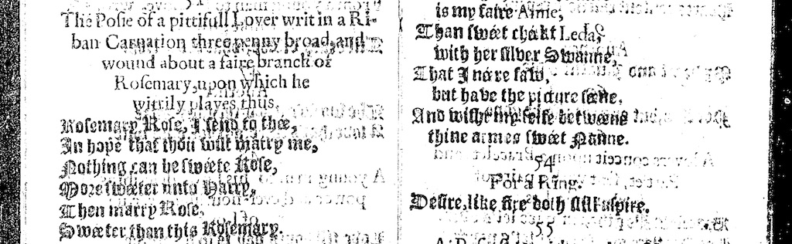

### “A Fair Branch of Rosemary”

<figure>

<figcaption>Rosemary Rose: an entreaty from Loves Garland.</figcaption>
</figure>

#### Olfactory Elements

Our handkerchief is embroidered and is accompanied by small vials of rosemary extract and rosewater, offering users the chance to experiment with some of the tactile and olfactory elements Loves Garland suggests embodied certain of its poems. Rosemary was a complicated though resonant element of the early modern sensual landscape. Its association with remembrance made it common in the performance of betrothals, marriages, and funerals. In the plague outbreaks of the early seventeenth century (the last of which, 1625, was just after the first edition of Loves Garland) rosemary was a ubiquitous plague preventative. The posy in *Loves Garland* that claims to be sent with a “fair branch of Rosemary” plays upon the beloved’s name, Rose, and the senders goal, marriage.

Smell is well known as the most memorial sense. Extending this wordplay to play with the senses, our vial of extract brings the medicinal and affective past of this scent into contact with the viewer/maker’s own scent-based memories. We likewise include a small vial of rosewater, realizing what the maid in this posy exchange sends back with her metered reply: “The sweet reply in a conceit of the same cut, sent by Rose with a Vyall of Rosewater of her making.” The kit gives us the chance to materialize certain of the poetry’s metaphors. Rosewater has a complex history in England, its earliest origins being Arabic and Jewish while in the textual record rosewater is re-cast as a fully English production. It is also a protestant analogue to Catholic incense and has strong associations with royalty. By the mid-sixteenth century, procedures for home distilling were common. Unlike ambergris or attar of roses, or any of the other scents no longer part of our olfactory experience, both rosemary and rosewater are still fairly common and can thus offer a different sense pathway between past and present in exploring our kit.

***

#### Works Cited

Dugan, Holly. *The Ephemeral History of Perfume: Scent and Sense in Early Modern England*. Baltimore, Md.: Johns Hopkins University Press, 2011.